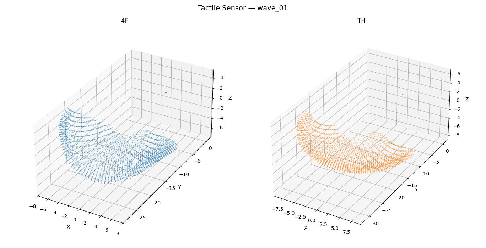

# Sharpa Tactile Sensor Assets

Visualization tool for tactile sensor point clouds and normals.

## Data Format

Each version directory (e.g. `wave_01/`) should contain the following files:

| File | Shape | Description |
|------|-------|-------------|
| `tactileSensor_map_4F_point.npy` | (240, 240, 3) | 4-Finger point coordinates |
| `tactileSensor_map_4F_normal.npy` | (240, 240, 3) | 4-Finger surface normals |
| `tactileSensor_map_TH_point.npy` | (240, 240, 3) | Thumb point coordinates |
| `tactileSensor_map_TH_normal.npy` | (240, 240, 3) | Thumb surface normals |
| `tactileSensor_4F.obj` | (240, 240, 3) | 4-Finger mesh |
| `tactileSensor_TH.obj` | (240, 240, 3) | Thumb mesh |

## Usage

```bash
# Downsample for faster rendering (keep every N-th point along each axis)
python script/visualize.py --path wave_01 --down-sample 8
```

## Preview


